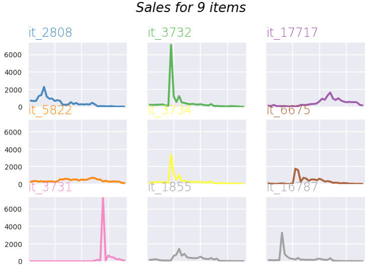
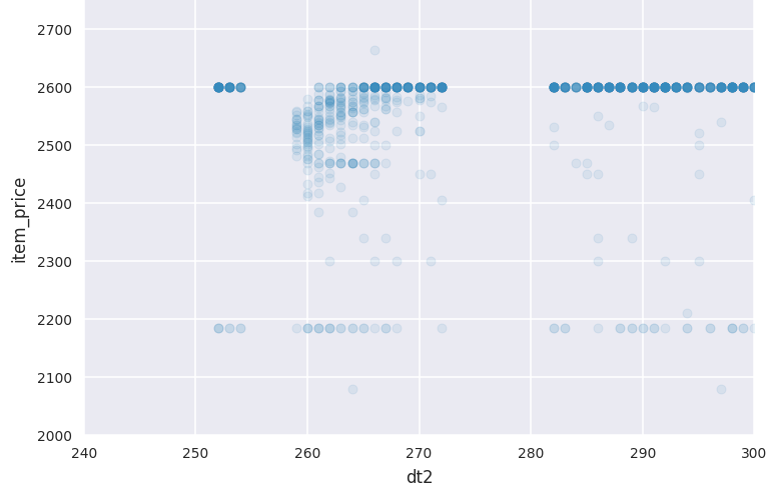
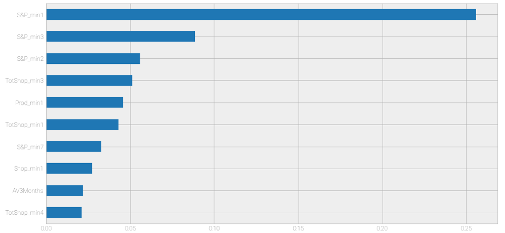
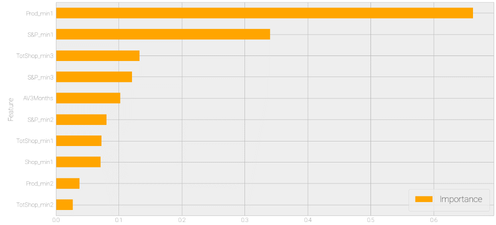

# Predicting Future Sales
This is where I document the work I carried out on the Kaggle competition to predict a month of sales for Russian software company 1C.  There were just under 3 years of data provided, at the product and shop level on a daily basis, and with this I need to create a prediction for November for every product and shop combination.  This meant that I needed to generate just over 214k predictions.  
This work involved **exploratory data analysis, data mungung, data cleaning, visualisation, building and tuning machine learning models.**  All of this was carried out in Python via Juypter Notebooks.
The evaluation criteria was Root Mean Squared Error, and the winning entry was 0.79215, and my best entry to date is 1.13087 using RandomForest.

The data and further information can be found [here](https://www.kaggle.com/c/competitive-data-science-predict-future-sales)

# Data Provided
We are provided with a main sales file, which identifies the quantity of the product sold in each shop, at which price, per day from a period of January 2013 to October 2015, with the target for prediction being November 2015.  
There are also 
  * an item file which provides a description of the product, unfortunately mostly in Russian, & a category id for the 22k products.  Whilst this was mostly in Russian, it did flag up that a number of these are computer games, which became a very relevant point.
  * an item category file which describes the category id, unfortunately in Russian, but shows there are only 84 categories
  * a shops file, which gives the (Russian) name for the id in the sales file, & shows there are 60 shops
  * the test file shows which product combinations are needed to be predicted and an ID with which can be merged on to the submission file
  
# Initial Data Analysis & Key Insights
Whilst there are over 22k products, initial data analysis found that there only 1654 products which are present in 31 or more of the 34 months in the dataset.  These sold an average of 5 per week, before I broke it further down into the 60 shops, yet represented 20% of total sales volume.  
Given this low volume, I then looked at the variance of some of these products graphically to understand what was happening.  The chart below shows the top 9 products by volume over the entire period.  The y axis is the volume and the x axis is the Month.

This shows that there are definitive peaks for most products.  However, this was not simply a case of new products as there was often some prior sales to the peak.  These peaks also happen at different times in the product lifetime.  Analysis of other products showed there were some with multiple peaks.  This variation in sales confirmed the need for the prediction, rather than just assuming a need for a low volume stocking per the average.

This led me to trying to understand this behaviour so I could build appropriate features for the model later.  Logically I expected price to be a major driver here, so I spend quite some time trying to understand the price behaviour as it pertained to sales volume.  There is quite some detail in this [Jupyter Notebook](https://github.com/jamesoliver1981/Future_Sales/blob/master/jupyter/EDA_J2_04_Price_variation.ipynb) but the chart below shows a couple of key insights from this work.  
This shows for one particularly product the price variation by days (since the start of the dataset).  The takeaways for me were:
1.  The price only seemed to start varying on the days when the volume really picks up.  
    * This suggests somekind of marketing campaign impacting performance for which we have no data.
2.  The frequency of sales is uneven until the peak and then it occurs almost every day.  
    * This suggests that volume was limited prior to the peak time and then availablity increased substantially.

 

# Feature Engineering

Using the insight from the price and sales behaviour, I constructed numerous variables which might enhance prediction, each had a value over the past 10 months.  
* Sales of that product in that shop
* Total sales of that product (given the sudden uptick and gap behaviour seen)
* Total number of shops where this was sold (given the lack of availability seen)
* Total amounts (of all products) sold in this shop previously (thinking here was that perhaps this justified where new products are released)
* Standard deviation of price of products (given that we saw how price really varied with sales)

The code where this is all built up is [here](https://github.com/jamesoliver1981/Future_Sales/blob/master/Modelling/J2_Feature_Engineering_Model2_ExistProds_Newshops_01.ipynb)

# Modelling

Having built this dataset, I ran a RandomForest with 1000 trees and set the minimum leaf size to be 5 to ensure that the model didn't overfit.  Whilst this was intended to be a baseline model, it ended up beating subsequent xgboost attempts with cross validation and tuning (although the results were very close).  

Whilst the key focus of this exercise is to generate an accurate model, in real life, we would be interested in understanding what the drivers of this were, so we could derive actions to improve performance.  Of course, this understanding would help us to determine better features to enhance the model.  Therefore below is the feature importance of the top 20 features from the RandomForest model.

 

Given that this is a regression problem rather than classification, the importance is defined by impurity calculated via the variance rather than information gain.  In xgboost, the default is coverage which skews the intepretation, but here we are looking at impurity.  However, the default **can** be biased.  Therefore we check this by running a permutation feature importance.  This creates a baseline model and then scrambles a variable and measures the decrease in R^2 to measure the variable importance.  This is discussed further [here](https://explained.ai/rf-importance/index.html).  This generates this feature importance plot.

 

Now we see that whilst the prior month is still important, its not the most important.  Interestingly other variables are now much more important such as how much was sold of that total product in the prior month, and the total amount that shop had sold upto 90 days ago.  

#General plan here
What do I want to show
    
    Analytical ability - spot trends
    Munging
    Visualisation ability
    Mutli model methods - rf & xgboost
    Model stacking - new products
    
Story

    Understanding target behaviour - often sold
    Understanding price - note the gap on how often sold prior - use to base the model
    Feature engineering - only talk about the 2nd one
    RF
    XG
    XG Tuning
    To add - those new products need a seperate model
    